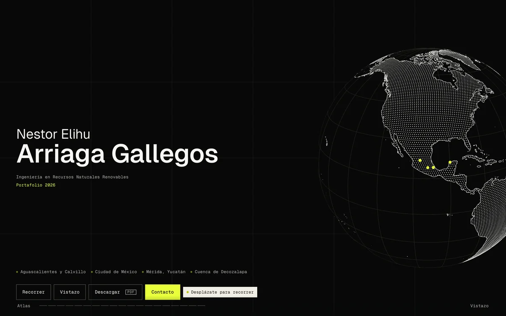

# Portafolio Atlas — Nestor Elihu Arriaga Gallegos

Atlas territorial interactivo: quince proyectos de cartografía, análisis territorial
y ordenamiento en seis territorios de México, más cuatro sistemas digitales propios.
El sitio y el PDF de 44 páginas se construyen desde los mismos registros.



## Estructura

| Serie | Contenido |
| --- | --- |
| **P01–P13** | Proyectos territoriales. Cada uno tiene su página interior con instrumentos cartográficos: localizador, mapa con clases, gradiente, nodos, comparador, atlas de detalles, perfil sincronizado, criterios ponderados, evidencia y flujo. |
| **P14** | GRANULAR — siete pilares con página propia en `/granular/[pilar]`. |
| **P15** | Urban Challenge — capítulo de dibujo arquitectónico. |
| **S01–S04** | SISTEMAS — capacidad digital aplicada al territorio: Datos aéreos agrícolas, ESTRATO, Maíces nativos y TERRITORIA, con página en `/sistema/[slug]`. |

El recorrido de la portada sigue ese orden: `P01–P13 → rostro territorial → GRANULAR →
Urban Challenge → SISTEMAS → contacto`. El índice orbital (*Vistazo*) reordena las
diecinueve entradas por territorio, método o escala.

### Fuentes del material

- Las láminas de P01–P15 proceden del documento original del portafolio; la página de
  origen se declara en cada proyecto y en el PDF.
- Las capturas de SISTEMAS son pantallas reales de aplicaciones propias, optimizadas y
  con su estado declarado —producto en desarrollo, demostrador o prototipo—. Las que
  usan datos simulados lo indican y no se presentan como resultados productivos.
- Ningún dato, cifra, escala o coordenada se completa cuando la fuente no lo registra.

## Requisitos

- Node.js 24.x
- npm 10 o superior
- Python 3.11+ con Pillow, sólo para regenerar activos derivados

## Uso

```bash
cd web
npm install

npm run dev           # http://localhost:4100
npm run typecheck     # TypeScript sin emitir
npm run lint          # ESLint
npm test              # pruebas de resolución de rutas
npm run build         # build de producción
npm run qa:rutas      # 26 rutas × 6 viewports: desbordes, imágenes rotas, consola
npm run portfolio:pdf # genera el PDF desde /portafolio-impreso
```

`qa:rutas` y `portfolio:pdf` necesitan el servidor levantado (`npm run dev` o
`npm start`). Ambos terminan con código distinto de cero si encuentran una hoja
desbordada, una imagen rota o un error de consola.

### PDF

`npm run portfolio:pdf` escribe:

```
web/public/downloads/Nestor-Arriaga-Gallegos-Portafolio-2026.pdf
```

A4 horizontal (297 × 210 mm), 44 páginas, etiquetado y con índice navegable. El botón
de descarga de la portada y el del cierre leen el peso y el número de páginas del
archivo real, así que la etiqueta nunca queda desfasada.

### Activos derivados

Los rásteres, máscaras de clase, marcadores y capturas del sitio son derivados de
material original que no se versiona. Los scripts de `web/scripts` los regeneran:

```bash
npm run atlas:sources        # láminas y manifiestos del atlas
npm run atlas:masks          # máscaras territoriales
SISTEMAS_FUENTES=<ruta/sistemas-fuentes.json> npm run sistemas
```

`SISTEMAS_FUENTES` apunta a un archivo de procedencia guardado fuera del repositorio:
contiene las rutas locales de las capturas originales. Lo que se publica es sólo el
manifiesto neutral `web/public/sistemas/manifest.json` y las imágenes optimizadas.

## Despliegue

La raíz de despliegue es `web/`. No hay `basePath` ni exportación estática: el sitio
usa el App Router de Next.js con rutas dinámicas prerenderizadas
(`generateStaticParams` en `/caso/[slug]`, `/granular/[pilar]` y `/sistema/[slug]`).

Define `NEXT_PUBLIC_SITIO` con el origen público para que `canonical`, Open Graph y
el sitemap resuelvan sobre el dominio real; sin esa variable se usa el puerto local.

Comprobaciones recomendadas en integración continua, en este orden: instalación limpia,
`typecheck`, `lint`, `test`, `build` y `qa:rutas`.

## Autoría y créditos

Dirección, diseño editorial, cartografía y desarrollo del portafolio:
**Nestor Elihu Arriaga Gallegos**.

Créditos y colaboraciones específicas se indican en cada proyecto. Las coautorías,
instituciones y fuentes cartográficas de los trabajos originales se conservan en la
página de fuentes del PDF y en las notas de cada proyecto. Las capturas de SISTEMAS
llevan el crédito de la cartografía base y de las imágenes satelitales que muestran.

## Licencia

El código de este repositorio no se publica bajo una licencia abierta. El contenido
—mapas, textos, dibujos, fotografías y capturas— pertenece a sus autores y a las
instituciones acreditadas en cada proyecto; no puede reutilizarse sin autorización.
# portfolio_nestor_arriaga
